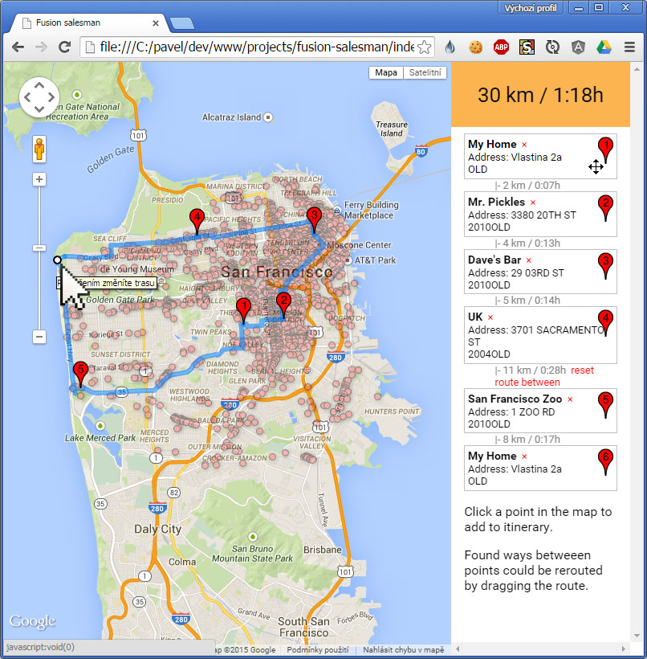

# Travelling salesman for Google Fusion Tables

Easily visualizes data from fusion table and provides a UI for creating the travel itinerary.
This tool is meant for a programmer to set up. Example below uses [this public table](https://www.google.com/fusiontables/DataSource?docid=1aQSsgRr0wHUcUQ7AYNWBtgoovZMs7qEF91VmzEfo). 

[LIVE DEMO](http://rawgit.com/zbycz/fusion-salesman/master/index.htm)

## Config.js

    config = {};
    
    config.center = [37.756614, -122.433652, 12];
    
    config.defaultPoint = {
    	gmapsLatLng: [37.756614, -122.433652],  //will be converted manually to new google.maps.LatLng()
    	'LOCATION_NAME': {value: 'My Home'}, 
    	'ADDRESS': {value: 'Vlastina 2a'}
    };
    
    config.fusionTablesQuery = {
    	select: '\'LOCATION_NAME\'',
    	from: '1aQSsgRr0wHUcUQ7AYNWBtgoovZMs7qEF91VmzEfo'
    };
    
    // everything between <%= and %> is eval'd
    config.cardHtmlTemplate = '<li class="card" data-index="<%= idx %>">'
    		+ '\')">'
    		+ '<b><%= getter("LOCATION_NAME") %></b> <a href="#">×</a> '
    		+ 'Address: <%= getter("ADDRESS") %> '
    		+ '<%= getter("YR_INSTALLED") + (getter("YR_INSTALLED") > 2010 ? "NEW" : "OLD") %>'
    		+ '</li>';

## Time complexity

## Author and licence

(c) 2014 [Pavel Zbytovský](http://zby.cz)

Licenced under MIT license.

 
